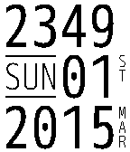

# Simplified Watchface for Pebble

A stylish watch face that conveys maximal information with minimal distraction. Simplified was inspired by the [Grid Lite watch face](https://apps.getpebble.com/applications/539b91cd199eae1e870000ab), features the amazing (and free!) [M+ M Type-2 font](http://mplus-fonts.sourceforge.jp/mplus-outline-fonts/design/index-en.html#mono), and is based on my [same-named visual theme](https://github.com/cowboy/textual-simplified-stealth) for the [Textual](http://www.codeux.com/textual/) and [Linkinus](https://itunes.apple.com/us/app/linkinus/id402390998?mt=12) IRC clients.

This watch face supports 12/24h modes and includes both dark and light variants.

 &nbsp;  &nbsp; 

[View in the Pebble App Store](https://apps.getpebble.com/applications/54e8b69fcaaeb29f9d00007e)
